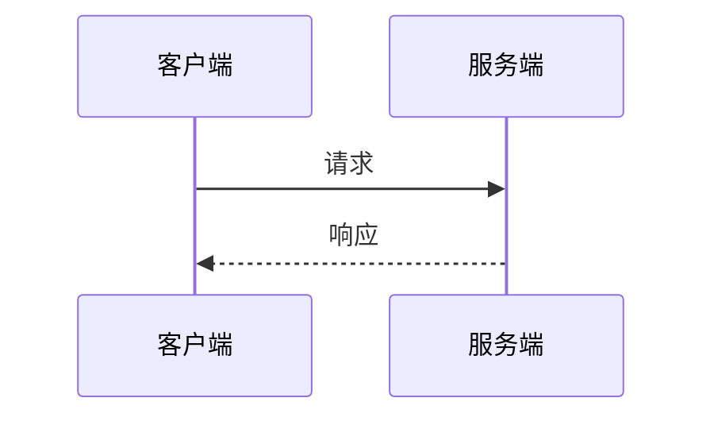

# Mermaid2AIChat

## Core Positioning

**get_input is the primary value**: fill the gap where AI IDEs cannot read visual editor content. When a user draws a flowchart in the visual editor, AI reads and analyzes it through `get_input`.

**create_view is an optional enhancement**: create a new editor tab and render Mermaid code as an interactive, editable canvas. Useful when the user needs to edit the diagram or when the diagram type benefits from the editor (e.g., flowchart, sequenceDiagram).

**list_views is a tab manager**: list all open tabs/views, including AI-generated history and user-created tabs, so the user can choose which view to read or switch to.

## Multi-Tab Architecture

- Each `create_view` call creates a **new tab** without overwriting existing views.
- `get_input` without `viewId` reads the **active tab** and marks it consumed.
- `get_input` with `viewId` reads a **specific historical tab** without changing its consumed state.
- `list_views` returns all tabs and the currently active one.

## Supported Diagram Types

### create_view supports 12 types

`flowchart`, `sequenceDiagram`, `classDiagram`, `erDiagram`, `mindmap`, `stateDiagram`, `architecture`, `gantt`, `pie`, `timeline`, `quadrantChart`, `xychart`.

If `diagramType` is omitted, auto-detect from the Mermaid code.

### get_input only supports graph canvas state (flowchart)

- `get_input` returns `status: 'error'` for non-graph canvas types such as `sequenceDiagram`, `classDiagram`, `gantt`, etc.
- For flowcharts, it returns the serialized Mermaid code.

## Tool Decision Tree

### Default behavior when user invokes the skill

Call `get_input` to read the active canvas, then respond based on the returned status.

### Scenario 1: user draws → AI reads (get_input)

Call `get_input` when the user says things like:

- "看看我画的"
- "分析这个流程"
- "我画了个图"
- "读取画布"
- "read my drawing"

Handle the `status` field:

- `status: 'success'` → analyze the returned `mermaid` code.
- `status: 'already_consumed'` → tell the user the canvas has been consumed; ask them to click "重新启用" or edit the canvas before asking again.
- `status: 'empty'` → tell the user the canvas is empty and ask them to draw first.
- `status: 'ai_content'` → tell the user the current canvas content is AI-generated; ask them to edit it if they want analysis.
- `status: 'error'` → show the error message (e.g., unsupported diagram type).

### Scenario 2: AI shows → user views (create_view)

Generate Mermaid code and call `create_view` when:

- The diagram is complex (5+ nodes or multiple participants).
- The user asks to edit or refine the diagram interactively.
- The diagram type is `flowchart`, `sequenceDiagram`, `classDiagram`, etc., and the editor adds value over a static code block.

After a successful call, tell the user the diagram has been shown in a new editor tab.

When `create_view` fails with parse errors, fix the Mermaid code and retry once. If it still fails, show the specific error to the user.

### Scenario 3: manage tabs (list_views)

Call `list_views` when:

- The user asks "有哪些视图", "列出标签页", "有什么图".
- The user wants to read a historical view by title or index.
- The user wants to know which tab is active.

### When not to call any tool

- The user only asks Mermaid syntax questions → answer directly.
- The user wants a simple 2-step flow → describe it in text.
- A simple flowchart (<5 nodes) and the user only needs to view it → output a Mermaid code block.

## Consumption State Machine

The canvas has a consumed state that controls whether `get_input` can read it:

- `CONSUME`: after AI successfully calls `get_input`, the active tab is marked consumed.
- `RESET`: the user clicks "重新启用" to make the canvas readable again.
- `CANVAS_EDIT`: any user edit resets the tab to unread and sets `canvasSource` to `user`.
- `CREATE_VIEW`: after AI calls `create_view`, the new tab is marked consumed with `canvasSource` set to `ai`.

Do not repeatedly call `get_input` after `already_consumed`; prompt the user to re-enable or edit instead.

## Mermaid Code Guidelines

### Core rules (always follow)

1. Generate syntactically valid Mermaid code.
2. For flowcharts, use the `flowchart` keyword (not `graph`).
3. Declare direction for flowcharts: `flowchart TD` or `flowchart LR`.
4. Use short node IDs for flowcharts (A, B, C, or meaningful short names).
5. Wrap node text in shape syntax: `A[开始]`.

### Supported flowchart shapes and edges

The editor supports 16 core flowchart shapes and 16 edge styles. See **`references/mermaid-syntax.md`** for the full table.

### Sequence diagram basics

`create_view` accepts `sequenceDiagram`. Example:

## Error Handling

### get_input errors

- Service unavailable: tell the user to start the Mermaid editor service with `pnpm dev`.
- `status: 'empty'`: tell the user to draw a flowchart first.
- `status: 'already_consumed'`: tell the user to click "重新启用" or edit the canvas.
- `status: 'ai_content'`: tell the user the canvas is AI-generated; edit before analysis.
- Unsupported diagram type: tell the user `get_input` currently only supports flowchart canvas reading.

### create_view errors

- Parse error: fix the Mermaid code and retry once. If it still fails, show the exact error.
- Service unavailable: tell the user to start the service with `pnpm dev`.

### Avoid infinite loops

- Do not retry `get_input` after `already_consumed`.
- Retry `create_view` at most once.

## Additional Resources

### Reference Files

- **`references/mermaid-syntax.md`** — complete flowchart shape/edge reference, sequence diagram basics, escape rules, and unsupported syntax list.

### Example Files

- **`references/examples.md`** — usage examples covering user drawing analysis, AI showing diagrams, sequence diagrams, empty canvas, consumed state, tab listing, retry logic, and service unavailable.

## Skill Collaboration Interface

### Positioning

AI-side entry point for the Mermaid reverse editor. Connects the visual editor with AI conversation through MCP, eliminating the copy-paste gap between editor and chat.

### Triggers

| Scenario | Description |
|----------|-------------|
| User draws and asks for analysis | User draws a flowchart in the editor and asks AI to read it |
| AI shows a diagram | AI generates Mermaid code and pushes it to a new editor tab |
| Tab management | User asks about open views or wants to read a historical tab |
| Slash command | User types `/mermaid2aichat` → default to `get_input` |

### Dependencies

| Dependency | Description |
|------------|-------------|
| MCP server `mermaid2aichat` | Provides `get_input`, `create_view`, and `list_views` |
| Visual editor | Web editor or VS Code extension where the user draws |

### Outputs

| Output | Description |
|--------|-------------|
| Flowchart analysis | Based on `get_input` Mermaid code |
| New editor tab | Created by `create_view` with rendered diagram |
| View list | Returned by `list_views` for tab management |
