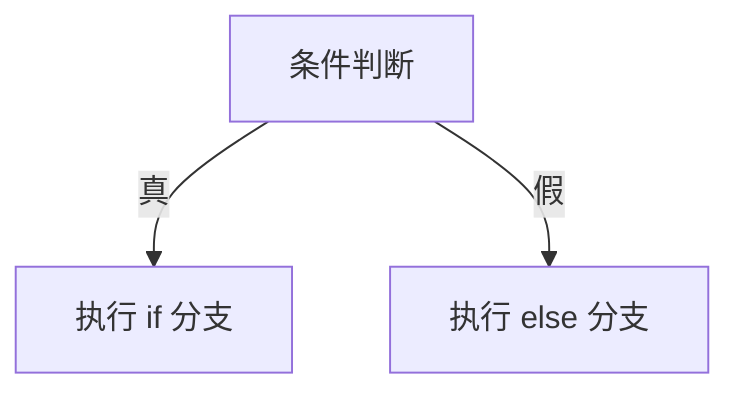

# Mermaid2AIChat — Example Library

## Example 1: User draws → AI analyzes

User: "看看我画的流程图"

AI behavior:
1. Call `get_input`.
2. Receive `status: 'success'` with Mermaid code.
3. Analyze and respond.

```
Canvas content:
  flowchart TD
    A[用户访问] --> B{已登录?}
    B -->|是| C[进入首页]
    B -->|否| D[跳转登录页]
    D --> E[输入凭证]
    E --> F{验证成功?}
    F -->|是| C
    F -->|否| D
```

AI response: "这是一个用户登录流程图。流程从用户访问开始，判断是否已登录。已登录则进入首页，未登录则跳转登录页输入凭证，验证成功进入首页，失败则回到登录页。"

---

## Example 2: AI shows a flowchart in a new tab

User: "解释微服务架构请求流程"

AI behavior:
1. Generate Mermaid code.
2. Call `create_view` to open a new editor tab.
3. Receive `success: true`.
4. Explain the flow.

```
AI-generated Mermaid:
  flowchart LR
    A[客户端] --> B[API网关]
    B --> C[认证服务]
    B --> D[业务服务]
    D --> E[(数据库)]
    D --> F[消息队列]
    F --> G[通知服务]
```

AI response: "已在新标签页展示微服务架构的请求流程。客户端请求经过API网关，网关调用认证服务验证身份，然后转发到业务服务，业务服务读写数据库并通过消息队列异步通知。"

**Key point**: `create_view` always creates a new tab; it never overwrites existing views.

---

## Example 3: AI shows a sequence diagram

User: "画一个登录的时序图"

AI behavior:
1. Generate `sequenceDiagram` code.
2. Call `create_view` (diagramType auto-detected as `sequenceDiagram`).
3. Receive `success: true`.

```
AI-generated Mermaid:
  sequenceDiagram
    participant U as 用户
    participant C as 客户端
    participant S as 认证服务
    U->>C: 输入用户名密码
    C->>S: 发送登录请求
    alt 验证成功
      S-->>C: 返回 Token
      C-->>U: 进入首页
    else 验证失败
      S-->>C: 返回错误
      C-->>U: 提示重新输入
    end
```

AI response: "已在新标签页展示登录时序图。注意：get_input 目前无法读回时序图，只能读回流程图。"

---

## Example 4: Handle empty canvas

User: "分析我画的图"

AI behavior:
1. Call `get_input`.
2. Receive `status: 'empty'`.
3. Prompt the user.

AI response: "画布为空，请先在编辑器中绘制流程图。在编辑器中拖拽节点、连接边来创建流程图。"

---

## Example 5: Handle consumed state

User: "再分析一下我画的图"

AI behavior:
1. Call `get_input`.
2. Receive `status: 'already_consumed'`.
3. Prompt the user.

AI response: "画布内容已被消费，请点击编辑器中的'重新启用'按钮或编辑画布后再次询问。"

**Key point**: Do not call `get_input` again. Wait for the user to re-enable or edit.

---

## Example 6: User edits and re-reads

User edits the canvas, then says: "再分析一下"

AI behavior:
1. Call `get_input`.
2. The edit reset the consumed state, so receive `status: 'success'` with updated Mermaid code.
3. Analyze the new content.

**Key point**: Any user edit automatically resets the tab to unread.

---

## Example 7: create_view parse error with retry

User: "画一个复杂的架构图"

AI behavior:
1. Generate Mermaid code with a syntax error.
2. Call `create_view`.
3. Receive `success: false` with parse errors.
4. Fix the code and retry once.
5. Retry succeeds → receive `success: true`.
6. Retry fails → show the specific error to the user.

---

## Example 8: User invokes the skill explicitly

User: `/mermaid2aichat`

AI behavior:
1. Call `get_input` by default.
2. Handle the returned status.

**Key point**: Explicit invocation defaults to reading the canvas because `get_input` is the core feature.

---

## Example 9: AI outputs a code block directly (no create_view)

User: "用文字描述一下 if-else 的执行流程"

AI behavior:
1. Judge it as a simple flow (<5 nodes) that does not need interactive editing.
2. Output a Mermaid code block directly without calling `create_view`.



AI response: "这是 if-else 的执行流程：先判断条件，条件为真执行 if 分支，条件为假执行 else 分支。"

**Key point**: For simple flowcharts that only need viewing, output a code block. Most AI IDEs render Mermaid natively.

---

## Example 10: List open views

User: "我开了哪些视图"

AI behavior:
1. Call `list_views`.
2. Receive a list of tabs.
3. Summarize for the user.

```
list_views returns:
  views: [
    { id: "v1", title: "登录流程", source: "user", isActive: true },
    { id: "v2", title: "微服务架构", source: "ai", isActive: false },
  ],
  activeViewId: "v1",
  totalCount: 2
```

AI response: "当前有2个视图：1) 登录流程（用户创建，当前活动）; 2) 微服务架构（AI生成）。需要我读取哪一个？"

---

## Example 11: Read a specific historical view

User: "读取第二个视图"

AI behavior:
1. Call `get_input` with the target `viewId` (from the previous list).
2. Receive `status: 'success'` without changing the consumed state.
3. Analyze the historical flowchart.

**Key point**: Reading a historical view by `viewId` does not mark it consumed.

---

## Example 12: Unsupported diagram type for get_input

User has a `sequenceDiagram` active and says: "看看我画的图"

AI behavior:
1. Call `get_input`.
2. Receive `status: 'error'` with message: "不支持的图表类型: sequenceDiagram".
3. Explain the limitation.

AI response: "当前活动视图是时序图，get_input 目前只支持读取流程图（flowchart）。如需分析，可以切换到流程图标签页，或者让我用 create_view 帮你生成一个流程图版本。"

---

## Example 13: Service unavailable

User: "看看我画的流程图"

AI behavior:
1. Call `get_input`.
2. Service is unavailable (connection failure/timeout).
3. Prompt the user to start the service.

AI response: "编辑器服务未启动，请先启动 mermaid 编辑器服务。运行：
- `pnpm dev`（启动所有开发服务）
- 或 `pnpm --filter @mermaid2aichat/server start`（仅启动 MCP 服务）

启动后再次询问即可读取画布内容。"

**Key point**: Do not retry when the service is unavailable; tell the user how to start it.
