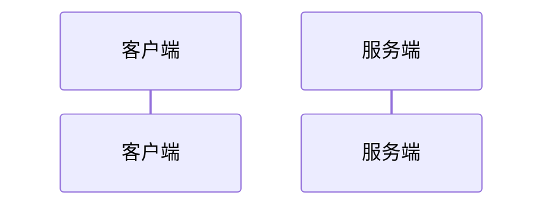
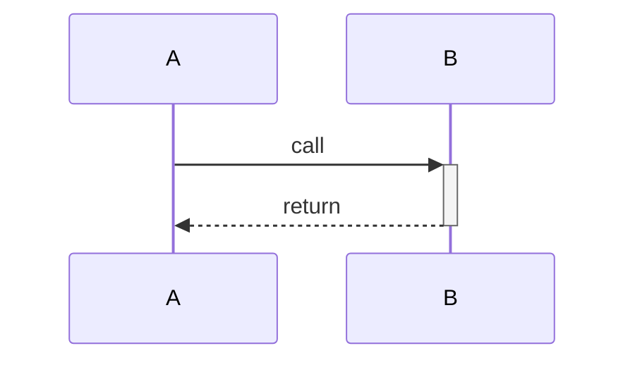
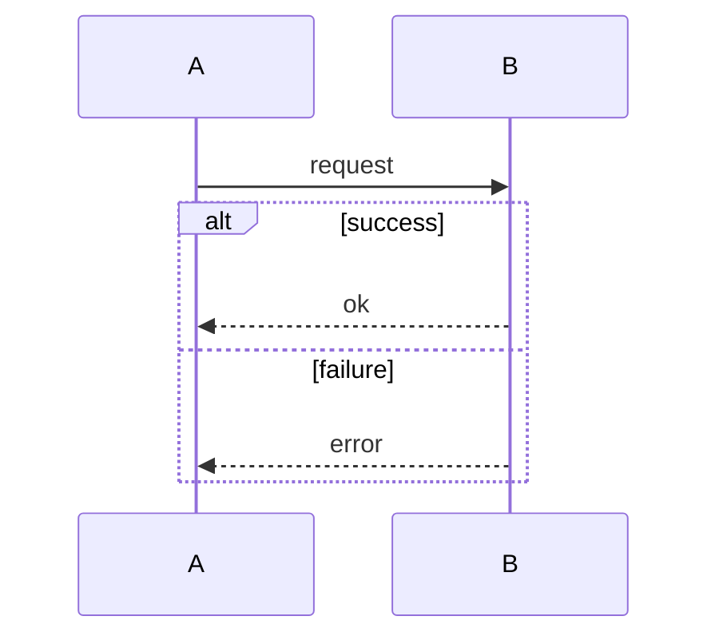
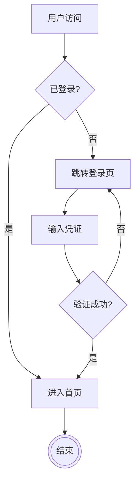
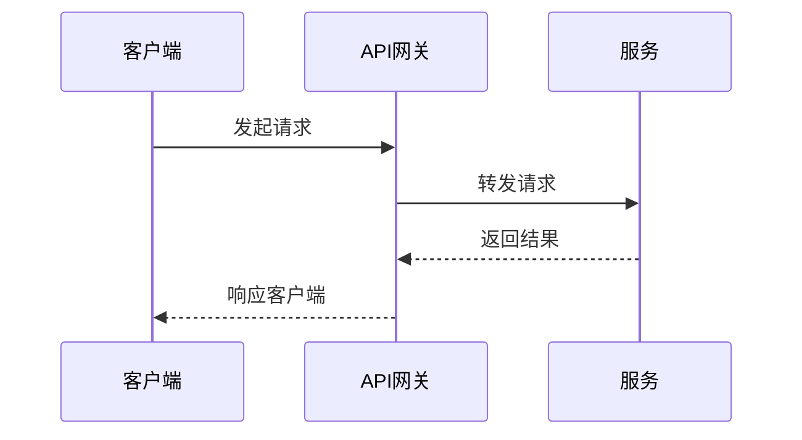

# Mermaid Syntax Reference

Reference for `get_input` analysis and `create_view` generation. The editor supports multiple diagram types; flowcharts are the only type readable by `get_input`.

## Flowchart Core Shapes (16)

| Shape | Syntax | Example | Note |
|-------|--------|---------|------|
| Rect | `[文本]` | `A[开始]` | Default process step |
| Rounded | `(文本)` | `B(处理)` | Rounded rectangle |
| Stadium | `([文本])` | `C([开始])` | Stadium/pill shape |
| Ellipse | `(-文本-)` | `D(-椭圆-)` | Ellipse |
| Subroutine | `[[文本]]` | `E[[子程序]]` | Subroutine call |
| Cylinder | `[(文本)]` | `F[(数据库)]` | Database/cylinder |
| Circle | `((文本))` | `G((节点))` | Circle |
| Double circle | `(((文本)))` | `H(((结束)))` | Double circle terminator |
| Diamond | `{文本}` | `I{判断}` | Decision/branch |
| Hexagon | `{{文本}}` | `J{{准备}}` | Preparation |
| Odd / asymmetric | `>文本]` | `K>旗帜]` | Flag/asymmetric |
| Trapezoid | `[/文本/]` | `L[/梯形/]` | Trapezoid |
| Trapezoid reverse | `[\文本\]` | `M[\倒梯形\]` | Reverse trapezoid |
| Lean right | `[/文本\]` | `N[/右倾\]` | Right-leaning parallelogram |
| Lean left | `[\文本/]` | `O[\左倾/]` | Left-leaning parallelogram |
| Rect with prop | `[\|field:value\|文本]` | `P[\|x:1\|带属性]` | Property-bearing rectangle |

Additional shapes are available through `@{shape: xxx}` metadata in the parser, but the 16 core shapes above are guaranteed to render correctly in the editor.

## Flowchart Edge Styles (16)

| Style | Syntax | Example |
|-------|--------|---------|
| Line | `---` | `A --- B` |
| Arrow | `-->` | `A --> B` |
| Cross | `--x` | `A --x B` |
| Circle | `--o` | `A --o B` |
| Thick line | `===` | `A === B` |
| Thick arrow | `==>` | `A ==> B` |
| Thick cross | `==x` | `A ==x B` |
| Thick circle | `==o` | `A ==o B` |
| Dotted | `-.-` | `A -.- B` |
| Dotted arrow | `-.->` | `A -.-> B` |
| Dotted cross | `-.x` | `A -.x B` |
| Dotted circle | `-.o` | `A -.o B` |
| Bidirectional arrow | `<-->` | `A <--> B` |
| Bidirectional cross | `x--x` | `A x--x B` |
| Bidirectional circle | `o--o` | `A o--o B` |
| Invisible | `~~~` | `A ~~~ B` |

### Edge Labels

Two equivalent forms:

```mermaid
A -->|是| B
A -- 是 --> B
```

### Edge Length

Increase `-` count to influence layout spacing:

| Length | Arrow | Line |
|--------|-------|------|
| 1 | `-->` | `---` |
| 2 | `--->` | `----` |
| 3 | `---->` | `-----` |

## Flowchart Direction

| Keyword | Direction |
|---------|-----------|
| `TB` | Top to bottom |
| `TD` | Top to down (same as TB) |
| `BT` | Bottom to top |
| `LR` | Left to right |
| `RL` | Right to left |

## Sequence Diagram Basics

`create_view` supports `sequenceDiagram`. `get_input` does **not** read sequence diagrams back.

### Participants



### Common Arrows

| Arrow | Syntax | Meaning |
|-------|--------|---------|
| Solid filled | `->>` | `A->>B: msg` |
| Dotted filled | `-->>` | `A-->>B: msg` |
| Solid open | `->` | `A->B: msg` |
| Dotted open | `-->` | `A-->B: msg` |
| Solid cross | `-x` | `A-xB: msg` |
| Dotted cross | `--x` | `A--xB: msg` |

### Activation Bars



### Blocks



Supported block types: `alt`, `opt`, `loop`, `par`, `critical`, `break`, `rect`.

## Code Rules

### Always follow

1. Use valid Mermaid syntax.
2. For flowcharts, use the `flowchart` keyword (not `graph`).
3. Declare direction for flowcharts: `flowchart TD` or `flowchart LR`.
4. Use short node IDs for flowcharts (A, B, C, or meaningful short names).
5. Wrap node text in shape syntax: `A[开始]` instead of bare `A`.

### Escape Rules

Escape these characters inside labels:

| Character | Escape |
|-----------|--------|
| `\` | `\\` |
| `"` | `\"` |
| `[` | `\[` |
| `]` | `\]` |
| `{` | `\{` |
| `}` | `\}` |
| `(` | `\(` |
| `)` | `\)` |
| `\|` | `\|` (in edge labels) |

### Caveats

1. Node IDs starting with `o` or `x` may be parsed as circle/cross endpoints; use uppercase or add a space.
2. Avoid lowercase `end` as node text; uppercase or partially uppercase it.
3. Inline links like `[text](url)` are not supported; put URLs as plain text.

## Unsupported Syntax

The editor does not support the following features. Avoid them in generated code.

| Unsupported | Reason | Alternative |
|-------------|--------|-------------|
| Click callbacks | `click` event handlers | Use labels or external documentation |
| Markdown links inside nodes | `[text](url)` | Plain text URL |
| Complex nested subgraphs | >2 levels of `subgraph` nesting | Flatten or split into separate diagrams |

Note: non-flowchart diagram types (`sequenceDiagram`, `classDiagram`, etc.) are **supported by `create_view`** but cannot be read back by `get_input`.

## Full Examples

### Flowchart



### Sequence Diagram


